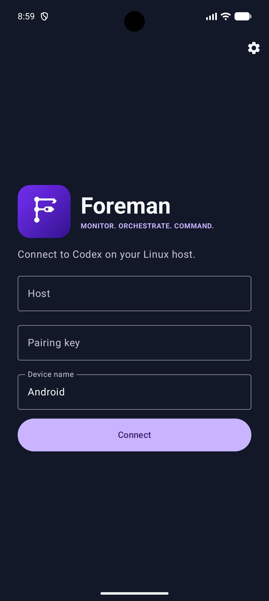
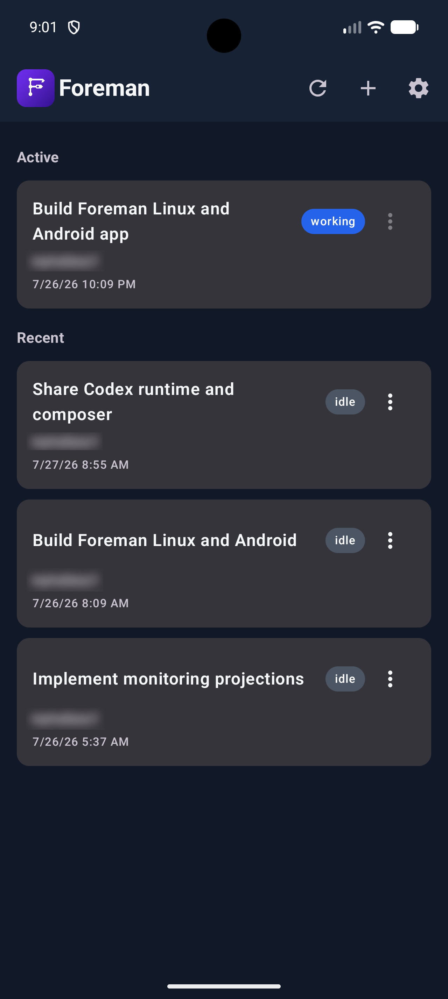
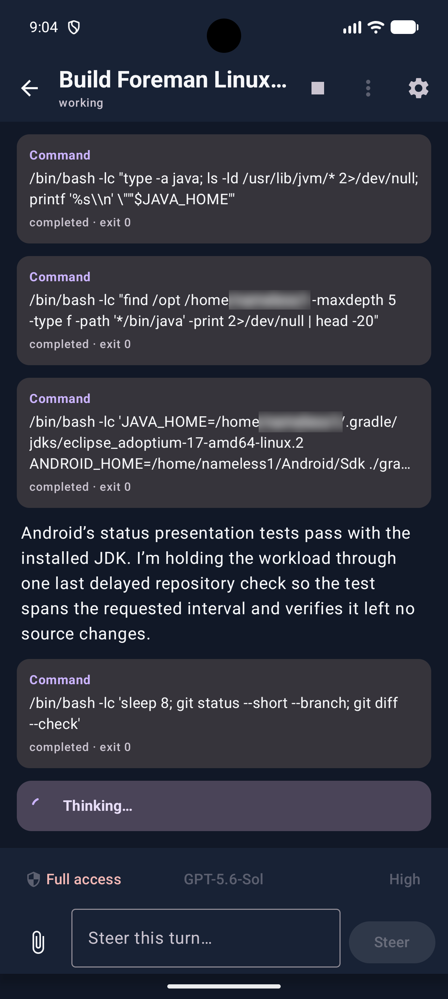
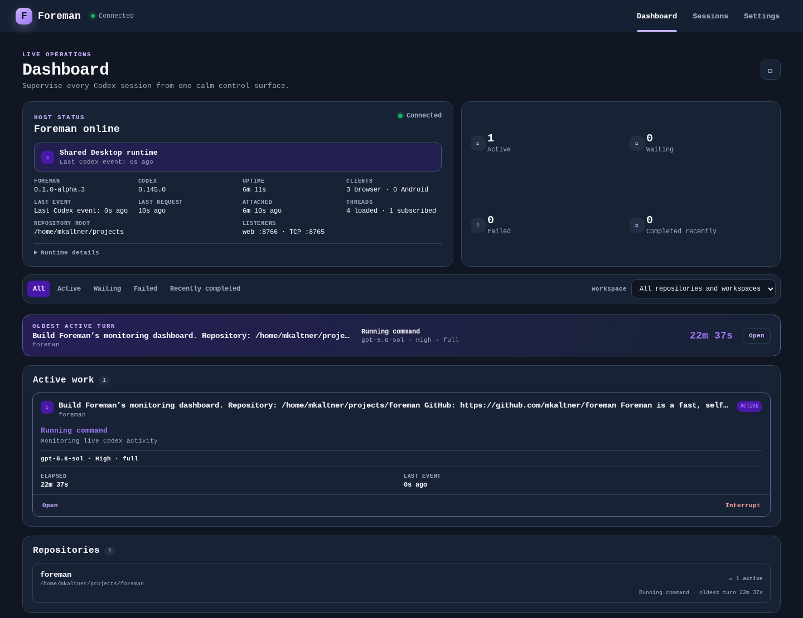
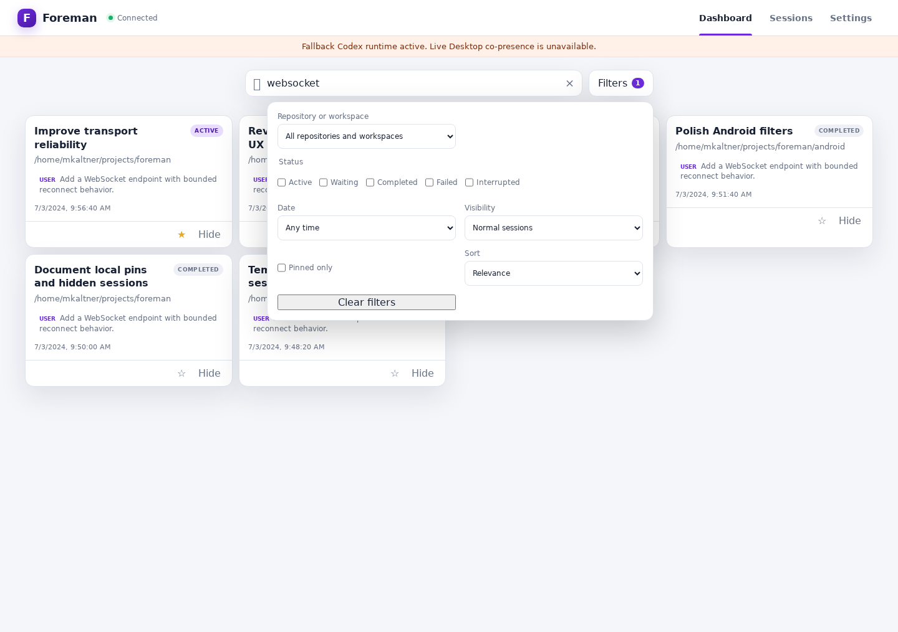
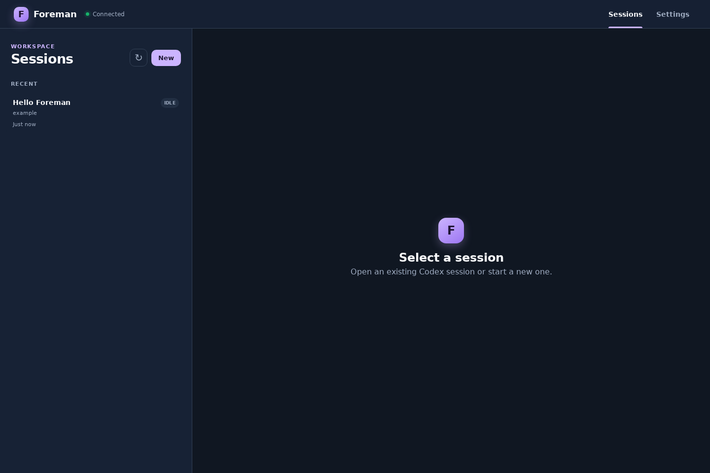
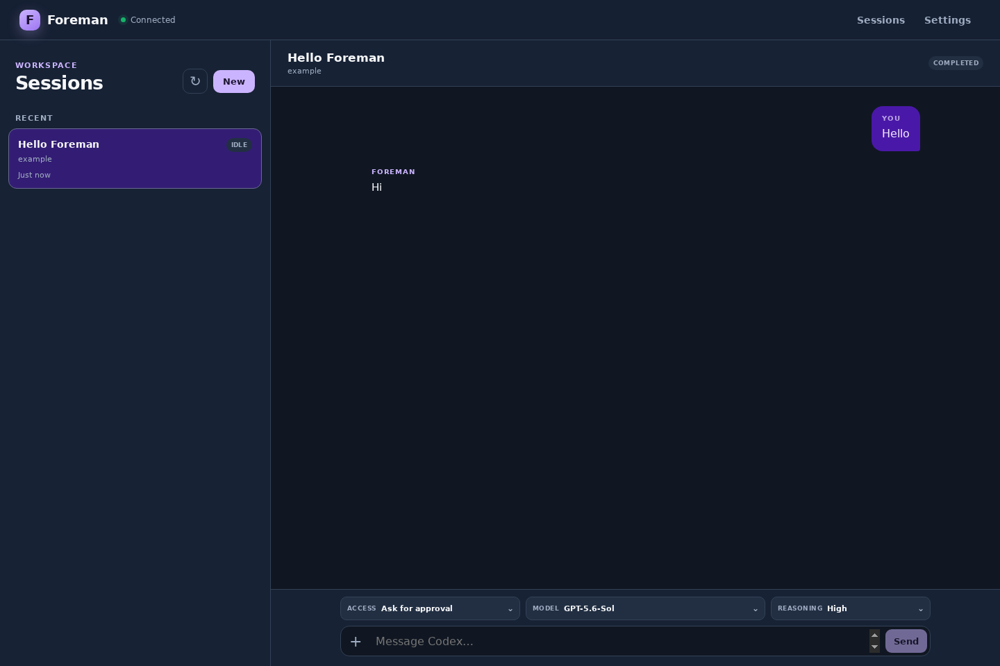
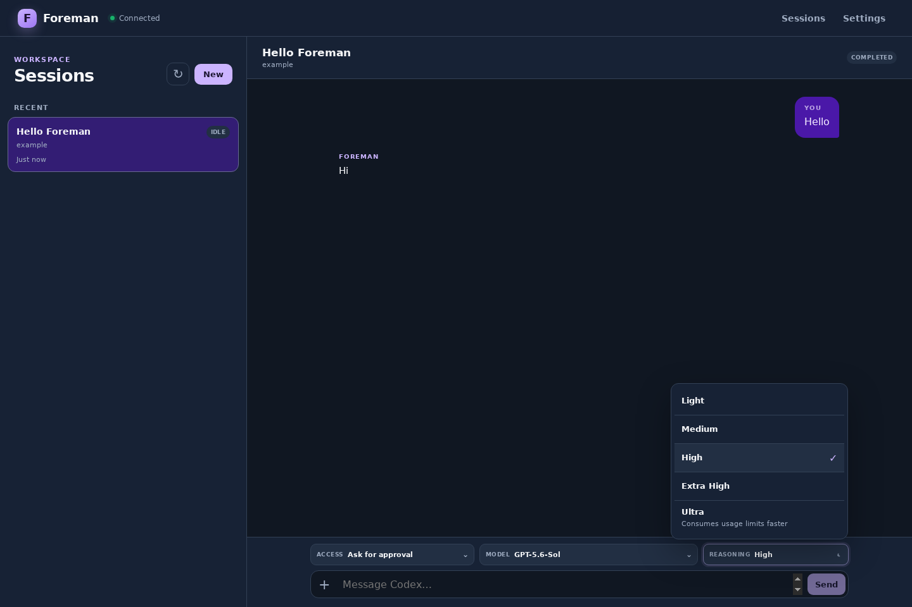
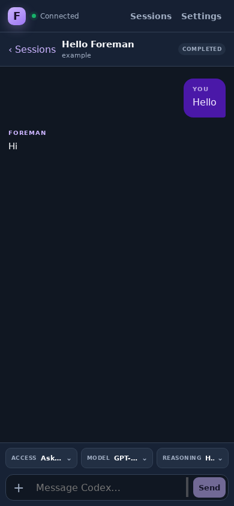

# Foreman

<p align="center">
  
  <br>
  <strong>A fast, self-hosted control plane for Codex.</strong>
</p>

Foreman provides lightweight Android and web interfaces for monitoring and
controlling Codex sessions running on Linux hosts. It connects directly to the
local Codex app-server and is designed for fast, LAN-first operation.

## Why Foreman?

Foreman is for people who want a dedicated Codex monitoring interface, fast
local interaction, and direct control of an always-on Linux host. It provides
self-hosted Android and browser access, visibility across active and recent
sessions, and controls for prompting, steering, interrupting, model, reasoning
effort, and access level.

## Foreman and Codex Remote

OpenAI's [Codex Remote](https://learn.chatgpt.com/docs/remote-connections) is the
first-party option for controlling Codex from the ChatGPT mobile app. It is a
good fit for people who want remote control integrated with the broader ChatGPT
experience.

Foreman is aimed at users who prefer a dedicated, self-hosted, LAN-first
interface and want direct access to their own Linux Codex host. It is designed
for low-latency local use and does not attempt to replace every first-party
Remote capability.

## Install

```sh
git clone https://github.com/mkaltner/foreman.git
cd foreman
./install.sh
```

Then verify the user service, create a short-lived pairing code, and print the
browser URL:

```sh
foreman status
foreman pair
foreman web
```

The Android transport and web client are served by the same
`foreman.service`; there is no separate web process to manage. Use:

```sh
foreman start       # start Android :8765 and web :8766
foreman stop        # stop both listeners
foreman restart     # restart after configuration changes
foreman status      # show service status and recent errors
foreman logs        # follow the user-service journal
```

To update:

```sh
cd foreman
git pull
./install.sh
```

Foreman requires Linux with user systemd, Python 3.10+, Git, and an authenticated
`codex` CLI. Its pinned Python dependency and prebuilt web assets are included,
so installation does not require pip, a Python virtual environment, Node, Java,
root access, or network access. Tagged Linux archives and signed Android APKs
are available from [GitHub releases](https://github.com/mkaltner/foreman/releases)
as an alternative.

## Features

- Pair clients with a short-lived, six-digit, one-time code.
- Reconnect with persistent token authentication and fresh authoritative state.
- Inspect paired browser and Android clients and revoke individual tokens.
- Supervise active, waiting, failed, stale, and recently terminal work from a
  live dashboard with an attention queue, oldest-turn callout, and activity feed.
- Discover Git repositories and browse active and recent Codex sessions.
- Search session titles and bounded, normalized visible transcript text.
- Filter by repository/workspace, status, local date range, pins, and hidden sessions.
- Pin important sessions or non-destructively hide noisy sessions per client.
- List, read, start, resume, archive, and delete sessions.
- Prompt, steer, and interrupt active work.
- Stream live status, assistant deltas, tool activity, and progress updates.
- Show current reasoning, plans, commands, tool names, and other meaningful
  live activity while Codex works.
- Select installed models, Android-style reasoning levels, and Codex access
  profiles from descriptive themed menus.
- Attach or paste up to four JPEG, PNG, or WebP images into a prompt or steer.
- Notify Android devices and supported background browser tabs when monitored
  turns finish or need attention.
- Follow light, dark, or system themes with a configurable accent color.
- Use dedicated Android and responsive web clients.
- Install as a rootless user-level systemd service without pip or a Python venv.

## Android

Download and sideload the signed APK from the matching tagged
[GitHub release](https://github.com/mkaltner/foreman/releases). Run `foreman pair`
on the Linux host, then enter the host name or IP address, pairing code, and a
device name in the app. Port `8765` is used when no port is given. Run
`foreman pair` again for each additional device.

For development builds, open [`android`](android) in a current Android Studio.
Android protects the persistent device token with Android Keystore.
The Sessions screen provides expandable search and a compact filter dialog for
repository/workspace, status, Today/7/30-day or custom date ranges, pinned-only,
and Hidden management. Search choices, pins, and hidden IDs use Android's
existing local preferences; transcripts and image data are never stored there.

## Web

The web client is bundled with the Linux installation; it does not require a
separate web-server package, Node, or another systemd unit. Install Foreman,
confirm the unified service is running, print the URL, and create a pairing
code:

```sh
git clone https://github.com/mkaltner/foreman.git
cd foreman
./install.sh
foreman status
foreman web
foreman pair
```

Open the printed URL—normally `http://HOST:8766`—from a current Chrome, Firefox,
or Edge release on a trusted network. Enter the host and six-digit pairing code.
The browser reconnects through the port that served the page, so there is no
separate port field. Run `foreman pair` again for each additional browser profile
or device.

`foreman web` only prints the configured URL; `foreman start`, `stop`, and
`restart` control both the web listener on `8766` and Android protocol listener
on `8765`. If a firewall is enabled, expose only the listener needed by each
trusted client or secure overlay.

The responsive dashboard provides:

- host, runtime, connection, and event freshness;
- connected-client counts and paired-client management;
- compact active-session cards with scan-friendly titles and the oldest active turn;
- a calm attention queue for waiting, failed, disconnected, or stale work;
- repository and non-Git workspace groups;
- a bounded, coalesced recent-activity feed.

The full web client also supports:

- the session list, conversation history, and live assistant/tool activity;
- starting sessions and sending prompts, steers, or interrupts;
- model, reasoning-effort, and access selection;
- file-picker and clipboard image attachments;
- archive and delete actions;
- opt-in browser notifications for background tabs;
- bounded reconnect without request replay;
- durable session URLs with Back, Forward, and refresh restoration;
- bookmarkable search/filter URLs, keyboard search navigation, local pins, and
  a restorable Hidden view;
- responsive dark/light/system themes and configurable accents.

Dashboard behavior and limits:

- Data remains live while the browser is connected.
- **No recent activity** is a conservative ten-minute browser heuristic. It
  never interrupts a turn or changes Codex state.
- Recent completion and feed data are not a permanent audit history.
- **Other workspaces** contains session roots that do not map to a discovered
  Git repository.
- Approval and structured-input waits must still be handled in another
  compatible Codex client.
- Search uses case-insensitive plain substrings. Criteria are ANDed, selected
  statuses are ORed, and hidden sessions stay excluded unless **Hidden
  sessions** is selected. Pins affect ordering, not matching.
- Transcript search reads at most 100 candidate histories per request, returns
  at most 100 sessions and three 200-character safe snippets per session, and
  creates no index or transcript cache. It is not fuzzy or semantic search.
- Pins and hidden-session choices are browser-local. They do not change Codex
  state or sync to Android.
- Host Status can show connected and offline paired clients. Revoking one removes
  only that authentication token, disconnecting its live connections without
  affecting sessions or repositories.

Browser notifications require HTTPS or localhost and work while Foreman remains
open in a background tab. For another LAN device, put the web listener behind a
trusted same-origin HTTPS reverse proxy. For example, Caddy can terminate TLS
and proxy both HTTP and WebSocket traffic:

```caddyfile
foreman.example.com {
    reverse_proxy 127.0.0.1:8766
}
```

Open `https://foreman.example.com`, pair that browser, then enable alerts under
**Settings → Notifications**. The hostname must use a certificate trusted by
the client device; Caddy's automatic public certificates or a client-trusted
internal CA both satisfy the browser secure-context requirement. Browser
storage does not provide Android Keystore protection; use **Disconnect and
forget host** before leaving a shared browser.

The installed SPA is prebuilt, so normal users do not need Node. Maintainers can
rebuild the committed assets with the pinned Node version as documented in the
[installation guide](docs/install.md).

## Screenshots

### Android

<table>
  <tr>
    <td align="center"></td>
    <td align="center"></td>
    <td align="center"></td>
  </tr>
  <tr>
    <td align="center">Pair with a Linux host</td>
    <td align="center">Browse live sessions</td>
    <td align="center">Monitor work in progress</td>
  </tr>
</table>

### Web

<p align="center">
  
  <br>
  <em>Live multi-session supervision and host health</em>
</p>

<p align="center">
  
  <br>
  <em>Bounded transcript search and composable session filters</em>
</p>

<table>
  <tr>
    <td align="center"></td>
    <td align="center"></td>
  </tr>
  <tr>
    <td align="center">Session list</td>
    <td align="center">Conversation and compact composer</td>
  </tr>
  <tr>
    <td align="center"></td>
    <td align="center"></td>
  </tr>
  <tr>
    <td align="center">Descriptive route controls</td>
    <td align="center">Responsive mobile layout</td>
  </tr>
</table>

## Architecture

```text
Android ── authenticated JSONL/TCP :8765 ─┐
                                          ├─ Foreman service ── Codex app-server
Browser ── HTTP + authenticated WS :8766 ─┘
```

- Android and browser clients use the same protocol-v1 messages.
- TCP uses newline-delimited JSON; WebSocket uses one JSON text message per frame.
- HTTP serves static assets and operational health only; there is no application REST API.
- Foreman connects to Codex over a Unix-socket WebSocket.

## Security

> [!CAUTION]
> Foreman transport is authenticated but not necessarily encrypted. Use a
> trusted LAN, Tailscale, WireGuard, or a trusted reverse proxy that provides
> encryption. Do not expose Foreman ports directly to the public internet.

Pairing codes expire after ten minutes and are valid for one use. Failed guesses
are throttled per source address. The service stores only device-token hashes;
Android protects its token with Android Keystore, while browser tokens remain in
`localStorage` without equivalent Keystore protection. Tokens are not placed in
URLs, cookies, logs, or analytics.

Foreman does not terminate TLS. When a trusted reverse proxy uses a different
origin, add its exact HTTPS origin to `FOREMAN_WEB_ORIGINS`; permissive wildcard
CORS is not enabled.

A paired client can control Codex with the access level selected for a turn, so
treat its token and network access as sensitive. Foreman does not expose a
standalone shell, Git-write, approval, or structured-input endpoint, but Codex
can still run tools and modify files according to its selected access profile.
Any authenticated Foreman client may revoke another paired token. Client lists
contain only the saved label, client type, pairing time, and live connection
state—never token values, token hashes, pairing codes, or source addresses.

## Codex Desktop runtime

Codex Desktop's default control socket is attach-only. Foreman never removes or
replaces that socket and never launches a process on it. When shared attachment
is unavailable, Foreman uses its own fallback socket and reports
`SHARED_DESKTOP_LIVE_STATUS_UNAVAILABLE`.

Fallback mode does not provide live co-presence with Codex Desktop. Stopping
Foreman closes its attachment or stops only the fallback process it owns; it
does not stop Desktop's Codex runtime.

## Known limitations

- Approval requests cannot yet be answered through Foreman.
- Structured user-input requests are not yet supported.
- Direct TCP and HTTP transport is not encrypted.
- Desktop live co-presence requires successful shared-socket attachment.
- Android distribution is currently sideloaded.
- Multi-host aggregation is not implemented.
- Recent dashboard activity is not a persistent audit history.
- Dashboard stale activity is an observation, not a failure or automatic action.
- Web support remains experimental during the alpha.

## Alpha status

Foreman is usable but still evolving. Breaking protocol or configuration
changes may occur, Android is currently distributed by sideloading, and web
support remains experimental. Foreman is not production-ready. Issues and
feedback are welcome in the [GitHub issue tracker](https://github.com/mkaltner/foreman/issues).

## Documentation

- [Installation guide](docs/install.md)
- [Architecture](docs/architecture.md)
- [Protocol](docs/protocol.md)
- [Release guide](docs/releasing.md)
